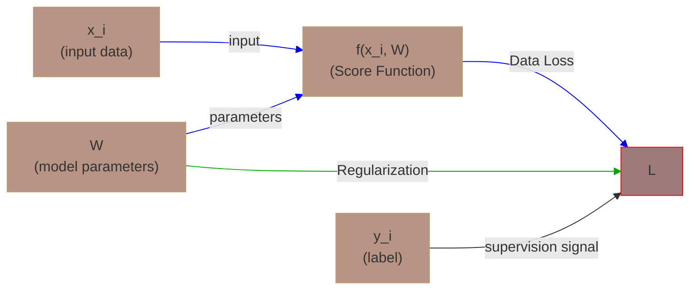
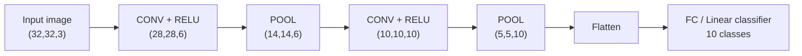
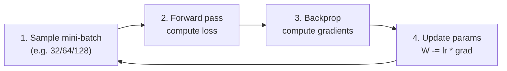
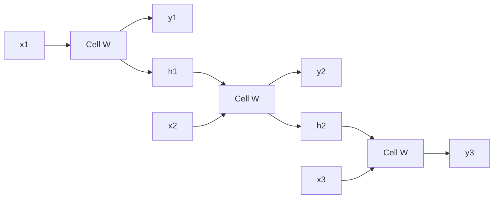
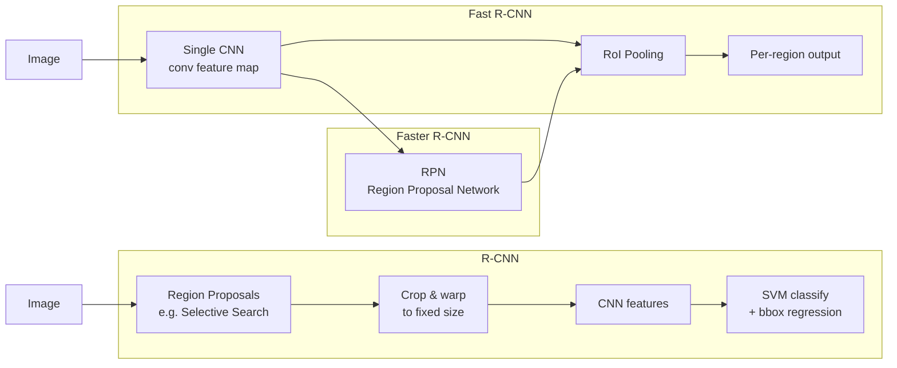
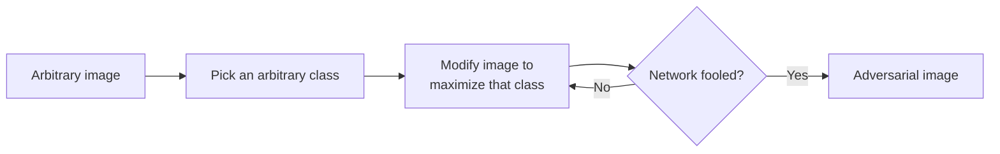
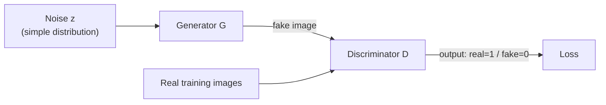
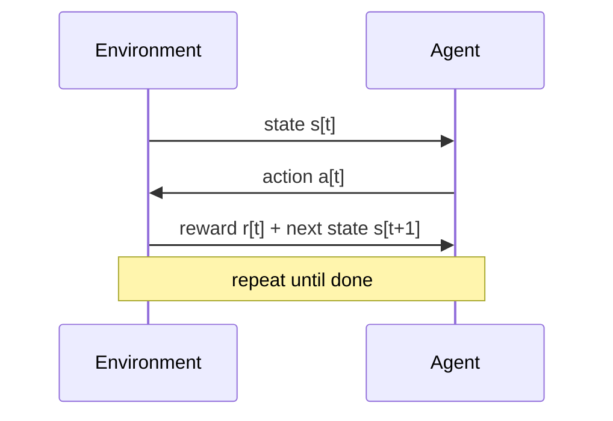

+++
date = '2026-09-19T14:00:00+08:00'
draft = false
slug = 'cs231n-2017-course-notes'
title = 'CS231n 2017 全课笔记'
tags = ["CS231n", "计算机视觉", "深度学习"]
description = "斯坦福 CS231n 2017 版全课笔记，按 16 讲顺序覆盖图像分类、损失函数与反向传播、卷积与经典架构、训练实务、序列与检测分割、生成模型与对抗样本、高效推理与硬件协同设计。英文正文，含 50 张课件配图。"
+++

Notes on the 2017 edition of CS231n.

## Foundations
### Lecture 01 Introduction to CNN for Visual Recognition

- A brief history of computer vision: from the late 1960s to 2017.
- Computer vision problems include image classification, object localization, object detection, and scene understanding.
- [ImageNet](http://www.image-net.org/) is one of the biggest datasets in image classification available right now.
- Starting from the 2012 ImageNet competition, CNNs (Convolutional Neural Networks) have always been winning.
- CNNs were actually invented back in 1998 by [Yann LeCun](http://ieeexplore.ieee.org/document/726791/).

#### History Highlights

| Year | Event |
| ---- | ----- |
| 1960s | Early computer vision research begins |
| 1998 | LeCun introduces CNNs (LeNet) for document/zip-code recognition |
| 2012 | AlexNet wins ImageNet — the deep learning era begins |
| 2012–2017 | CNNs dominate vision benchmarks across many tasks |

#### Core Problems in Computer Vision

- **Image classification** — assign a label to a whole image (Lecture 02 Image Classification)
- **Object localization / detection** — find and classify objects with bounding boxes
- **Scene understanding** — interpret the full context of an image

#### Why CNNs?

- CNNs encode the assumption that inputs are images directly into the architecture, making them vastly more efficient than fully connected networks for vision.
- Large datasets like ImageNet plus GPU computing power are what made deep CNNs practical.

### Lecture 02 Image Classification

- Python + numpy is important to vector and tensor.
- The core task of computer vision is **image classification**.
- Computer sees pixels, a grid of numbers: semantic gap.
- How to be robust to changes is a challenge.


#### Data Driven Approach

1. collect a dataset of images and labels
2. use machine learning to train a classifier
3. evaluate the classifier on new images

```python
def train(images, labels):
 # machine learning
 return model

def predict(model, test_images):
 # use model to predict labels
 return test_labels
```

- CIFAR10 is a small dataset including 10 classes, 50000 training images and 10000 testing images.

#### KNN (K-nearest-neighbor)

- Hyperparameters of this algorithm are K and the distance measure.
- K is the number of neighbors compared. By calculating the distance between the new sample and the training data, identify the K nearest neighbors, and use their labels (for classification) or values (for regression) to make predictions.
- L1 distance (Manhattan distance): $d_1(I_1, I_2) = \sum\limits_p |I_1^p-I_2^p|$, for coordinate points.
- L2 distance (Euclidean distance): $d_{\text{2}}(\mathbf{x}, \mathbf{y}) = \sqrt{\sum_{i=1}^n (x_i - y_i)^2}$, for noncoordinate points.
- KNN algorithm is highly sensitive to the local structure of the data.

[Visualization](http://vision.stanford.edu/teaching/cs231n-demos/knn/)

##### How to determine the hyperparameter?

- We can't use the whole dataset as training data because we don't care about fitting the training data. We really care about performed in the unseen data. The dataset cannot represent the wild unseen data.
- Train data + validation data + test data is a good idea.
- **Cross validation** is better.
 1. Split the dataset into `f` folds.
 2. Given predicted hyperparameters: Train your algorithm with `f-1` folds and test it with the remain fold and repeat this with every fold.
 3. Choose the hyperparameters that gives the best training values (Average over all folds)

#### Linear Classification

image $32 \times 32 \times 3$, 3072 numbers $\xrightarrow[f(x,W)\text{ transformation}]{\text{classification}}$ 10 classes

$$
\begin{aligned}
f(x, W) &= Wx + b \\
\underbrace{\begin{bmatrix}
f_1 \\ f_2 \\ \vdots \\ f_{10}
\end{bmatrix}}_{10 \times 1} &= 
\underbrace{\begin{bmatrix}
w_{1,1} & w_{1,2} & \cdots & w_{1,3072} \\
w_{2,1} & w_{2,2} & \cdots & w_{2,3072} \\
\vdots & \vdots & \ddots & \vdots \\
w_{10,1} & w_{10,2} & \cdots & w_{10,3072}
\end{bmatrix}}_{10 \times 3072}
\underbrace{\begin{bmatrix}
x_1 \\ x_2 \\ \vdots \\ x_{3072}
\end{bmatrix}}_{3072 \times 1} + 
\underbrace{\begin{bmatrix}
b_1 \\ b_2 \\ \vdots \\ b_{10}
\end{bmatrix}}_{10 \times 1}
\end{aligned}
$$

- **Input x**: 3072×1 column vector (flattened image pixel values).
- **Weight matrix W**: 10×3072, where each row corresponds to the weights for one class.
- **Bias b**: 10×1, the bias term for each class.
- **Output f(x, W)**: 10×1, representing the scores (logits) for the 10 classes.

##### Bias Trick

We can append a constant `1` to the input vector and absorb the bias into the weight matrix:

$$f = Wx \quad \text{where} \quad x \in \mathbb{R}^{3073},\; W \in \mathbb{R}^{10 \times 3073}$$

so that $Y = WX$ without a separate bias term.

##### Alternatives to Linear Classification

| Classifier | Idea | Limitation |
| ---------- | ---- | ---------- |
| KNN | Compare distances to training samples | Poor on high-dimensional images; never used for real vision |
| Linear SVM | Max-margin linear decision boundary | The curse of dimensionality makes it stop improving at some point |
| Logistic regression | Probabilistic linear classifier | Image classification is **non-linear** — linear models can't capture it |

- We need to know how to get `W` and `b` that makes the classifier runs at best.

### Lecture 03 Loss Function and Optimization

A **loss function** can measure how good or bad the current parameters are.

$$
Loss =L(f(x_i,W),y_i)
$$$$
Loss\_for\_all = \frac 1N  \sum L(f(x_i,W),y_i)
$$

**Optimization** is to minimize the loss function given some parameters.

#### Multiclass SVM Loss

Loss function for a linear SVM classifier:
$$
L_i = \sum_{j \neq y_i} \max(0, s_j - s_{y_i} + \Delta) \quad (\Delta=1)
$$  
- $s_j$: Scores of error categories.
- $s_{y_i}$: Scores of right categories.
- $\Delta=1$: We are happy if the best prediction are the same as the true value other wise we give an error with 1 margin.

Loss for all:  
$$
L = \frac{1}{N} \sum_{i=1}^N L_i
$$

This is called _hinge loss_.

##### Example

 $s = f(x,W) = Wx$  

| **Categories** | **cat** | **car** | **frog** |
| -------------- | ------- | ------- | -------- |
| **cat**        | 3.2     | 1.3     | 2.2      |
| **car**        | 5.1     | 4.9     | 2.5      |
| **frog**       | -1.7    | 2.0     | -3.1     |
| **Loss**       | 2.9     | 0       | 12.9     |

###### Calculation
1. cat
   error categories：car ($5.1 - 3.2 + 1 = 2.9$), frog ($-1.7 - 3.2 + 1 = -3.9$) 
   $L_i = \max(0, 2.9) + \max(0, -3.9) = 2.9$  
2. car
   error categories：cat ($1.3 - 4.9 + 1 = -2.6$), frog ($2.0 - 4.9 + 1 = -1.9$) 
   $L_i = 0$ （all the error categories satisfy $s_{y_i} \geq s_j + 1$）  
3. frog
   error categories：cat ($2.2 - (-3.1) + 1 = 6.3$), car ($2.5 - (-3.1) + 1 = 6.6$)  
   $L_i = 6.3 + 6.6 = 12.9$  

$L = \frac{1}{N} \sum_{i=1}^N L_i = \frac{2.9 + 0 + 12.9}{3} = 5.27$

###### Another Numerical Example


Given this example we compute the loss for the cat image:

$$L = \max(0, 437.9 - (-96.8) + 1) + \max(0, 61.95 - (-96.8) + 1) = 535.7 + 159.75 = 695.45$$

The loss is big, reflecting that the cat score needs to be the best over all classes — it is currently the lowest. We need to minimize that loss.

###### Discussion
1. If the car score changes, loss will not change because the margin of one will still be retained.
2. What is the min/max possible loss? Zero/infinity.
3. At initialization, W is small so all s≈0, the loss is number of class minus one.
4. If the loss is zero, is that value unique for the parameters? **No** — there are a lot of parameters that can give the best score. This is why we add regularization.

###### Summary
- **Sparsity**: The loss is zero when the score of the correct class is sufficiently high.
- **Margin Sensitivity**: $\Delta=1$ requires the correct score to be at least 1 higher than the incorrect scores.
- Its OK for the margin to be 1. But its a hyperparameter too.
- A **squared hinge loss** (L2-SVM) penalizes violated margins quadratically instead of linearly; the unsquared version is more standard, but the squared version can work better on some datasets.

##### Regularization

- We care about the performance on test data instead of training data.
- We add **regularization** for the loss function so that the discovered model don't overfit the data.
- Regularizations is called **weight decay**. Biases should not be included in regularization.

Full loss:
$$ L(W)=\frac{1}{N} \sum_{i=1}^{N} L\bigl(f(x_i, W), y_i\bigr) + \lambda\, R(W) $$
$\lambda$ = regularization strength is an important hyperparameter.

| Regularizer | Equation | Comments |
| ----------- | -------- | -------- |
| L2 | $R(W) = \sum_k\sum_l W_{k,l}^2$ | Sum of all W squared |
| L1 | $R(W) = \sum_k\sum_l \|W_{k,l}\|$ | Sum of all Ws with abs |
| Elastic net (L1 + L2) | $R(W) = \beta \sum_k\sum_l W_{k,l}^2 + \sum_k\sum_l \|W_{k,l}\|$ | |
| Dropout | — | No equation (see Lecture 06 Training Neural Networks I) |

In common use:
 - **L2 regularization**:  $R(W)=\sum_k\sum_l W_{k,l}^2$
 - L1 regularization:  $R(W)=\sum_k\sum_l |W_{k,l}|$
 - Elastic net: $(L1 + L2)R(W)=\sum_k\sum_l \beta\,W_{k,l}^2+|W_{k,l}|$
 - Max norm regularization (might see later)
 - Dropout (will see later)
 - Fancier: Batch normalization, stochastic depth

| Property | L2 Regularization | L1 Regularization |
|---|---|---|
| **Penalty term** | Sum of squared weights | Sum of absolute weights |
| **Nature of solution** | Smooth solution | Sparse solution |
| **Geometric constraint** | Spherical constraint | Diamond (polytope) constraint |
| **Gradient behavior** | Proportional to the weight | Constant gradient (±1) |
| **Computational complexity** | Easy to optimize | Needs special handling at the non-differentiable zero point |
| **Feature handling** | Keeps all features | Automatic feature selection |
| **Noise robustness** | Stronger | Weaker |

#### Softmax Classifier (Multinominal Logistic Regression) (Cross-Entropy)

Softmax function (generalizes logistic regression to more than 2 classes):

$$ P(Y = k \mid X = x_i) = \frac{e^{s_k}}{\sum_j e^{s_j}} $$

The output is a normalized probability distribution — the vector sums to 1.

$$ L_{i} = -\log\left(\frac{e^{s_{y_{i}}}}{\sum_{j} e^{s_{j}}}\right) $$

Log of the probability of the good class. We want it to be near 1, that's why we added a minus. Softmax loss is called cross-entropy loss.

##### Numerical Stability

```python
f = np.array([123, 456, 789]) # example with 3 classes and each having large scores
p = np.exp(f) / np.sum(np.exp(f)) # Bad: Numeric problem, potential blowup

# instead: first shift the values of f so that the highest number is 0:
f -= np.max(f) # f becomes [-666, -333, 0]
p = np.exp(f) / np.sum(np.exp(f)) # safe to do, gives the correct answer
```

| Property   | SVM Loss   | Softmax Loss |
| ---- | ---------- | ------------ |
| What it penalizes | Relative score difference (margin) | Probability distribution difference (cross-entropy)  |
| Output interpretation | Unnormalized scores     | Normalized probabilities        |
| Typical use cases | When clear classification boundaries matter  | Tasks that require probability estimates    |



#### Optimization: Gradient Descent

- Strategy one (bad idea): get random parameters, try them all on the loss, and keep the best.
- Strategy two: **follow the slope**.


Image [source](https://rasbt.github.io/mlxtend/user_guide/general_concepts/gradient-optimization_files/ball.png).

Our goal is to compute the gradient of each parameter we have:

| Gradient type | Properties |
| ------------- | ---------- |
| **Numerical gradient** | Approximate, slow, easy to write (useful for debugging) |
| **Analytic gradient** | Exact, fast, error-prone (always used in practice) |

$$ \theta_{t+1} = \theta_t - \alpha \cdot \nabla J(\theta_t) $$
- $\theta_t$ : model parameters
- $J(\theta_t)$: total loss function
- $\nabla J(\theta_t)$ : gradient of the loss with respect to the parameters
- $\alpha$: learning rate — too large causes oscillation, too small makes convergence slow (common values: 0.01, 0.001)

Gradient descent is mainly used to **minimize an objective function (such as the loss function)**, thereby finding the optimal parameters of a model. Its core roles include:
1. **Parameter optimization**: iteratively adjusting model parameters (such as weights and biases) so that the loss decreases step by step and prediction accuracy improves.
2. **Solving complex optimization problems**: applies to high-dimensional, non-convex optimization (e.g., neural network training); even when no closed-form solution exists, gradient information can approximate the optimum.
3. **Supporting large-scale training**: combined with stochastic gradient descent (SGD) or mini-batch gradient descent, it can efficiently handle massive datasets.

learning_rate is the most important hyperparameter — get the best value of it first of all the hyperparameters.

Stop when one of the following holds:
   - The gradient is near zero (convergence)
   - The maximum number of iterations is reached
   - The change in the loss function falls below a threshold.

##### Gradient Descent Variants and Optimization Tips
1. Classic variants
    - Batch Gradient Descent (BGD): uses the full dataset for every gradient computation — stable but expensive.
    - Stochastic Gradient Descent (SGD): picks one random sample at a time — fast but noisy.
    - Mini-batch Gradient Descent: a compromise; common batch sizes are 32/64/128.
2. Advanced optimizers
    - Momentum: incorporates a weighted average of past gradients to accelerate convergence and reduce oscillation.
    - Adam: combines momentum with adaptive learning rates (as in RMSProp); well suited to deep learning.
3. Tuning tips
    - Feature scaling: normalize the input data to speed up convergence.
    - Learning rate decay: gradually shrink the learning rate (e.g., exponential decay).

##### Pitfalls and Cautions
1. Local optima and saddle points: non-convex functions may get stuck in local optima; this can be mitigated by random initialization or momentum.
2. Gradient problems: deep networks may suffer from vanishing/exploding gradients, which need to be addressed with BatchNorm or residual connections.
3. Computational efficiency: for large datasets prefer SGD or Mini-batch GD, and use GPU parallelism for acceleration.

```python
W = W - learning_rate * W_grad
```

### Lecture 04 Introduction to Neural Network

#### Computational graphs

- Used to represent any function with nodes.
- Using computational graphs can easy lead us to use back-propagation, even with complex models like CNN and RNN.
- In a computational graph, we call each operation `f`. For each `f` we calculate the **local gradient** before we go on back propagation, and then we compute the gradients with respect to the loss function using the chain rule.
- You can split each operation to as simple as you want, but the nodes will be a lot. If you want the nodes to be bigger, be sure that you can compute the gradient of that node.

- Back-propagation simple example:
    - Suppose we have `f(x,y,z) = (x+y)z`
    - Then graph can be represented this way:
      ```text
        X         
          \
           (+)--> q ---(*)--> f
          /           /
        Y            /
                    /
                   /
        Z---------/
      ```
        
    - We made an intermediate variable `q` to hold the values of `x+y`
    - Then we have:
        ```python
        q = (x+y)              # dq/dx = 1 , dq/dy = 1
        f = qz                 # df/dq = z , df/dz = q
        ```
    - Then:
        ```python
        df/dq = z
        df/dz = q
        df/dx = df/dq * dq/dx = z * 1 = z   # Chain rule
        df/dy = df/dq * dq/dy = z * 1 = z   # Chain rule
        ```

##### A Bigger Example


- Hint: the back propagation of two nodes going to one node from the back is by **adding** the two derivatives.

##### Modularized Implementation: Forward/Backward API

```python
class MultiplyGate(object):
    """
    x,y are scalars
    """
    def forward(x,y):
        z = x*y
        self.x = x  # Cache
        self.y = y  # Cache
        # We cache x and y because we know that the derivatives contains them.
        return z
    def backward(dz):
        dx = self.y * dz
        dy = self.x * dz
        return [dx, dy]
```

If you look at a deep learning framework, you will find it follows the modularized implementation where each class has a definition for forward and backward. For example:

| Operation | Has learnable parameters |
| --------- | ---------------------- |
| Multiplication | — |
| Max / Min | — |
| Plus / Minus | — |
| Sigmoid | — |
| Convolution | yes |

#### Neural Network as a Function

So to define neural network as a function:

- (Before) Linear score function: $f = Wx$
- (Now) 2-layer neural network: $f = W_2 \max(0, W_1 x)$
    - Where $\max$ is the ReLU non-linear function
- (Now) 3-layer neural network: $f = W_3 \max(0, W_2 \max(0, W_1 x))$
- And so on...

Neural networks are a stack of simple operations that together form complex operations.

## Convolutions and Architectures
### Lecture 05 Convolutional Neural Networks

- ConvNet architectures make the explicit assumption that the **inputs are images**, which allows us to encode certain properties into the architecture.
- There are a few distinct types of layers in a ConvNet (e.g. CONV/FC/RELU/POOL are by far the most popular).
- Each layer may or may not have parameters (e.g. CONV/FC do, RELU/POOL don't).
- Each layer may or may not have additional hyperparameters (e.g. CONV/FC/POOL do, RELU doesn't).
- A typical ConvNet is a stack of (CONV → RELU) blocks with POOL layers to downsample, followed by a linear classifier.

#### Layers Overview

| Layer | Parameters? | Hyperparameters? |
| ----- | ----------- | ---------------- |
| CONV | yes ($W$, $b$) | # filters K, filter size F, stride S, padding P |
| RELU | no | no |
| POOL | no | filter size F, stride S |
| FC | yes | # hidden neurons |

#### Fully Connected Layer

- A fully connected (dense) layer connects every neuron to all inputs.
- If input shape is $(X, M)$, the weight shape is $(\text{NoOfHiddenNeurons}, X)$.

#### Convolution Layer

- Keeps the spatial structure of the input by sliding a filter over the whole image.
- Computed with a dot product: $W^\top X + b$ (broadcasting).
- We usually treat the filter ($W$) as a vector, not a matrix.
- The output of a convolution is an **activation map**; we need multiple activation maps (one per filter).

##### Shapes Example

| Stage | Shape | Notes |
| ----- | ----- | ----- |
| Input image | $(32,32,3)$ | |
| Filter size | $(5,5,3)$ | depth must match input depth |
| Output of Conv (6 filters) | $(28,28,6)$ | one filter → $(28,28,1)$ |
| After RELU | $(28,28,6)$ | |
| Another filter | $(5,5,6)$ | |
| Output of Conv | $(24,24,10)$ | |

- ConvNets learn in the first layers the **low-level features**, then mid-level, then high-level features.
- After the ConvNets we can attach a linear classifier for a classification task.
- Number of filters is usually a power of 2 (to vectorize well).

#### Stride

- Stride is skipping while sliding; by default it is 1.
- Given a $(7,7)$ matrix and a $(3,3)$ filter:
  - stride 1 → output $(5,5)$ (# 2 dropped)
  - stride 2 → output $(3,3)$ (# 4 dropped)
  - stride 3 → doesn't work
- General formula: $O = \dfrac{N - F}{\text{stride}} + 1$

$$O = \frac{N - F}{S} + 1$$

| stride | $O = (7-3)/S + 1$ | result |
| ------ | ----------------- | ------ |
| 1 | $4 + 1$ | 5 |
| 2 | $2 + 1$ | 3 |
| 3 | $1.33 + 1$ | 2.33 — doesn't work |

#### Padding

- In practice it's common to **zero-pad** the border (padding from both sides).
- For stride 1, common to pad with $(F-1)/2$ where $F$ is the filter size:
  - $F = 3$ → pad with 1
  - $F = 5$ → pad with 2
- This is called a **same convolution** — output size equals input size.
- Padding maintains the full size of the input; without it the input shrinks too fast and we lose a lot of data. (Alternative techniques pad corners with non-zeros, but zeros work in practice.)

##### Example

- Input $(32,32,3)$, ten filters of $(5,5)$, stride 1, pad 2 → output $(32,32,10)$ (size maintained).
- Parameters per filter: $5 \cdot 5 \cdot 3 + 1 = 76$.
- All parameters: $76 \cdot 10 = 760$.

##### Conv Layer Hyperparameters Summary

| Hyperparameter | Typical values | Notes |
| -------------- | -------------- | ----- |
| Number of filters K | power of 2 | |
| Spatial filter size F | 3, 5, 7, ... | |
| Stride S | 1 or 2 | big stride → downsampling (different from pooling) |
| Padding P | $(F-1)/2$ for same conv | |

#### Pooling

- Pooling makes the representation **smaller and more manageable**; it operates over each activation map independently.
- **Max pooling**: parameters are filter size and stride, e.g. $2 \times 2$ with stride 2 (usually the two are equal).
- **Average pooling**: the average case; can be learnable.



### Lecture 09 CNN Architectures

- This lecture covers the famous CNN architectures, focusing on the winners of the ImageNet competition since 2012.
- Key architectures: **AlexNet** (2012), **ZFNet** (2013), **VGGNet** / **GoogLeNet** (2014), **ResNet** (2015), and successors.
- Main trends: smaller filters + deeper networks (VGG), efficient local modules (Inception), and skip connections / residual learning (ResNet).
- ImageNet classification error dropped from 16.4% (2012) to 3.57% (2015) — better than human-level error.


#### LeNet-5 (1998)

- The first ConvNet, by Yann LeCun. Used for digit recognition.
- Architecture: `CONV-POOL-CONV-POOL-FC-FC-FC` — exactly **5** layers.
  - 
- Each conv filter was $5 \times 5$ applied at stride 1; each pool was $2 \times 2$ applied at stride 2.
- Key insight: image features are distributed across the entire image, and convolutions with learnable parameters extract similar features at multiple locations with few parameters.
- In 2010, Ciresan & Schmidhuber published one of the very first GPU neural nets (forward + backward on an NVIDIA GTX 280, up to 9 layers).

#### AlexNet (2012)

- The ConvNet that started the deep learning revolution; won ImageNet 2012 with **16.4%** error.
- Architecture: `CONV1-MAXPOOL1-NORM1-CONV2-MAXPOOL2-NORM2-CONV3-CONV4-CONV5-MAXPOOL3-FC6-FC7-FC8` — exactly **8** layers (5 convolutional + 3 fully connected).
- Total: **60 million** parameters. For a $227 \times 227 \times 3$ input, the layer shapes are:

| Layer | Config | Output shape | Weights |
|---|---|---|---|
| CONV1 | 96 filters $11 \times 11$, stride 4, pad 0 | $(55, 55, 96)$ | $11 \cdot 11 \cdot 3 \cdot 96 + 96 = 34{,}944$ |
| MAXPOOL1 | $3 \times 3$, stride 2 | $(27, 27, 96)$ | none |
| NORM1 | (no longer used) | $(27, 27, 96)$ | — |
| CONV2 | 256 filters $5 \times 5$, stride 1, pad 2 | $(27, 27, 256)$ | — |
| MAXPOOL2 | $3 \times 3$, stride 2 | $(13, 13, 256)$ | none |
| CONV3 | 384 filters $3 \times 3$, stride 1, pad 1 | $(13, 13, 384)$ | — |
| CONV4 | 384 filters $3 \times 3$, stride 1, pad 1 | $(13, 13, 384)$ | — |
| CONV5 | 256 filters $3 \times 3$, stride 1, pad 1 | $(13, 13, 256)$ | — |
| MAXPOOL3 | $3 \times 3$, stride 2 | $(6, 6, 256)$ | none |
| FC6 / FC7 | 4096 neurons each | — | most of the parameters |
| FC8 | 1000 neurons (class scores) | — | — |

- Other details:
  - First use of **ReLU**.
  - Norm layers (no longer used today).
  - Heavy data augmentation; dropout $0.5$; batch size $128$; SGD momentum $0.9$; learning rate $10^{-2}$, reduced by 10 at some iterations.
  - An ensemble of 7 CNNs was used.
- Trained on a GTX 580 with only 3 GB, so the feature maps were split across two GPUs — the first AlexNet was distributed!
- Still widely used for transfer learning. See Lecture 05 Convolutional Neural Networks for conv layer mechanics.

#### ZFNet (2013)

- Won 2013 with **11.7%** error. Same general structure as AlexNet (also **8** layers), just better hyperparameters:
  - CONV1: changed from $(11 \times 11, \text{stride } 4)$ to $(7 \times 7, \text{stride } 2)$.
  - CONV3,4,5: instead of 384, 384, 256 filters use 512, 1024, 512.

#### OverFeat (2013)

- Won the ImageNet **localization** task in 2013.
- Showed how a multiscale and sliding window approach can be efficiently implemented within a ConvNet, and introduced a deep learning approach to localization by learning to predict object boundaries.

#### VGGNet (2014, Oxford)

- Deeper network with **16–19** layers; won 2014 (with GoogLeNet) with **7.3%** error.
- Key insight: **smaller filters with deeper layers**. Multiple $3 \times 3$ convolutions in sequence emulate the effect of larger receptive fields (e.g. three $3 \times 3$ convs have the same effective receptive field as one $7 \times 7$ conv), while adding more nonlinearity and fewer parameters.
- 
- Architecture: several CONV layers then a POOL layer, repeated 5 times, then fully connected layers.
- **138 million** parameters — most are in the fully connected layers.
- ~96 MB of memory per image for forward propagation only — most memory is in the earlier (high-resolution) layers.
- Trained similarly to AlexNet (momentum, dropout, etc.).
- VGG19 is a slightly better upgrade of VGG16, at the cost of more memory.
  - 

#### GoogLeNet (2014)

- **22** layers; won 2014 (with VGGNet) with **6.7%** error.
- Only **5 million** parameters — 12× fewer than AlexNet — thanks to the efficient **Inception module** and no fully connected layers.

##### Inception module

- Design a good local network topology ("network within a network", inspired by NiN), then stack these modules on top of each other.
- Structure:
  - Apply **parallel filter operations** on the input from the previous layer:
    - Multiple convolutions of sizes $1 \times 1$, $3 \times 3$, $5 \times 5$ (with padding to preserve spatial size).
    - A (max) pooling operation (with padding to preserve size).
  - **Concatenate** all filter outputs depth-wise.

```python
# Naive Inception module: input 28 x 28 x 256
# Parallel branches:
#   1x1 conv, 128 filters   -> output (28, 28, 128)
#   3x3 conv, 192 filters   -> output (28, 28, 192)
#   5x5 conv,  96 filters   -> output (28, 28, 96)
#   3x3 max pooling         -> output (28, 28, 256)
# Concatenation             -> output (28, 28, 672)
```

- **Problem (naive version)**: huge computational cost. For the example above:

| Operation | FLOPs (approx.) |
|---|---|
| $1 \times 1$ conv, 128 | $28 \cdot 28 \cdot 128 \cdot 1 \cdot 1 \cdot 256 \approx 25$ M |
| $3 \times 3$ conv, 192 | $28 \cdot 28 \cdot 192 \cdot 3 \cdot 3 \cdot 256 \approx 346$ M |
| $5 \times 5$ conv, 96 | $28 \cdot 28 \cdot 96 \cdot 5 \cdot 5 \cdot 256 \approx 482$ M |
| **Total** | **~854 M operations** |

- **Solution: bottleneck layers** using $1 \times 1$ convolutions to reduce feature depth before the expensive $3 \times 3$ and $5 \times 5$ convs (inspired by NiN).
  - 
  - The bottleneck version costs only **358 M** operations in this example.
- GoogLeNet stacks Inception modules and removes FC layers entirely; it uses an average pooling layer before the final classification.
  - 
- **Inception V2** (Feb 2015): batch-normalized Inception. Batch-norm computes the mean and standard deviation of all feature maps at the output of a layer and normalizes their responses (see Lecture 06 Training Neural Networks I).
- **Inception V3** (Dec 2015): "Rethinking the Inception Architecture for Computer Vision" — better factorization, explains the older Inception models.
- Note: the first GoogLeNet and VGG predate batch normalization, so they needed hacks to train and converge well.

#### ResNet (2015, Microsoft Research)

- **152-layer** model for ImageNet; winner with **3.57%** error — better than human-level error.
- The very first time a network of more than 100 (even 1000) layers was trained. Swept all classification and detection competitions in ILSVRC'15 and COCO'15.

##### The problem with very deep "plain" networks

- When you keep stacking layers on a plain CNN, the deeper model performs **worse** — and it's **not** caused by overfitting. Deeper networks are simply harder to optimize.
- A deeper model should be able to perform at least as well as the shallower one (by construction: copy the learned layers and set the extra layers to identity mapping).

##### Residual block

- ResNet's solution: learn a **residual mapping** instead of a direct mapping, and add the input back (a skip / shortcut connection):

```python
# Instead of learning a new representation H(x) directly,
# learn only the residual F(x) = H(x) - x
Y = W2 * relu(W1 * x + b1) + b2 + x
```

- 
- Say you have a network of depth $N$. You only want to add a new layer if it contributes something new. By providing the input $x$ unmodified to the output of the $(N+1)$-th layer, the new layer is driven to learn something **different** from what the input already encodes.
- The additive connections also help with the **vanishing gradient** problem in very deep networks (gradients flow through the shortcut, like in LSTMs — see Lecture 10 Recurrent Neural Networks).
- With residual blocks, we can build networks of any depth without fearing that we can't optimize them.

##### Full ResNet architecture

- 
- Stack residual blocks; every residual block has two $3 \times 3$ conv layers.
- Additional conv layer at the beginning.
- No FC layers at the end (only a FC 1000 for class scores).
- Periodically, double the number of filters and downsample spatially using stride 2.
- Deep ResNets use a **bottleneck** layer (like the Inception bottleneck) to reduce dimensions:
  - 
- Training recipe:
  - Batch normalization after every CONV layer.
  - Xavier/2 initialization from He et al.
  - SGD + momentum $0.9$; learning rate $0.1$, divided by 10 when validation error plateaus.
  - Mini-batch size $256$; weight decay $10^{-5}$; no dropout.

#### Comparison and Complexity


| Architecture | Year | Depth | Params | ImageNet error | Notes |
|---|---|---|---|---|---|
| LeNet-5 | 1998 | 5 | ~60 K | — | Digit recognition |
| AlexNet | 2012 | 8 | 60 M | 16.4% | ReLU, GPUs, dropout |
| ZFNet | 2013 | 8 | — | 11.7% | Tuned AlexNet |
| VGGNet | 2014 | 16–19 | 138 M | 7.3% | Highest memory, most ops |
| GoogLeNet | 2014 | 22 | 5 M | 6.7% | Inception, most efficient |
| ResNet | 2015 | 152 | — | 3.57% | Skip connections, >human |

- **Inception-v4** (2016): ResNet + Inception combined.

#### ResNet Improvements and Beyond

| Work | Year | Idea |
|---|---|---|
| Identity Mappings in Deep Residual Networks | 2016 | From the ResNet creators; better-performing residual block design |
| Wide Residual Networks | 2016 | Residuals matter more than depth; a 50-layer wide ResNet beats the 152-layer ResNet; width is more computationally efficient (parallelizable) |
| Deep Networks with Stochastic Depth | 2016 | Randomly drop a subset of layers during each training pass; use full network at test time (reduces vanishing gradients + training time) |
| FractalNet | 2017 | Ultra-deep nets without residuals; key is transitioning effectively from shallow to deep; train with sub-path dropout |
| DenseNet (Densely Connected CNNs) | 2017 | Dense skip connections between all layers |
| SqueezeNet | 2017 | AlexNet-level accuracy with 50× fewer parameters, <0.5 MB model size; good for production |

#### Conclusion

- **ResNet** is the current best default architecture.
- Clear trend towards extremely deep (and wide) networks.
- In recent years, most new models use shortcut connections of some kind to let gradients flow easily.

## Training Practice
### Lecture 06 Training Neural Networks I

- Revision: the Mini-batch stochastic gradient descent loop.
- Choosing **activation functions**: Sigmoid/Tanh/ReLU/Leaky ReLU/ELU/Maxout.
- **Data preprocessing**: zero-center (mean image or per-channel mean).
- **Weight initialization**: small random, Xavier, He — zero init is a failure mode.
- **Batch normalization**: normalize activations to zero mean/unit variance, then scale & shift with learnable parameters.
- **Babysitting the learning process** and **hyperparameter optimization** (log-space random search).

#### Mini-batch SGD Loop

1. Sample a batch of data.
2. Forward prop it through the graph (network) and get loss.
3. Backprop to calculate the gradients.
4. Update the parameters using the gradients.



#### Activation Functions


##### Sigmoid

$$\sigma(x) = \frac{1}{1 + e^{-x}}$$

- Squashes numbers to $[0,1]$; interpreted as a firing rate like human brains.
- Problems:
  - **Kills gradients**: saturated neurons (big/small values) have gradients near 0, killing updates in deep networks.
  - **Not zero-centered**: outputs are all positive, so gradients on weights are all positive/negative — zig-zag dynamics.
  - $\exp()$ is a bit compute expensive.

##### Tanh

$$\tanh(x)$$

- Squashes numbers to $[-1,1]$ — **zero-centered**.
- Still kills gradients at saturation.
- Proposed by Yann LeCun in 1991.

##### ReLU (Rectified Linear Unit)

$$\text{ReLU}(x) = \max(0, x)$$

- Doesn't kill gradients for positive inputs (only the negative half is dead).
- Computationally efficient; converges much faster than sigmoid/tanh ($\sim 6\times$).
- More biologically plausible; proposed by Alex Krizhevsky (2012, AlexNet).
- Problems: not zero-centered; with bad initialization ~75% of neurons can be dead (wasted computation — but it still works). To mitigate, initialize all biases by 0.01.

##### Leaky ReLU

$$\text{LeakyReLU}(x) = \max(0.01x,\; x)$$

- Doesn't kill gradients on either side; will not die.
- PReLU: the 0.01 is replaced by a learnable parameter $\alpha$.

##### Exponential Linear Units (ELU)

$$
\text{ELU}(x) = \begin{cases} x & x > 0 \\ \alpha (e^x - 1) & x \le 0 \end{cases}
$$

- Has all the benefits of ReLU; closer to zero-mean outputs; adds robustness to noise.
- Problem: $\exp()$ is compute expensive.

##### Maxout

$$\text{maxout}(x) = \max(w_1^\top x + b_1,\; w_2^\top x + b_2)$$

- Generalizes ReLU and Leaky ReLU; doesn't die.
- Problem: **doubles** the number of parameters per neuron.

##### Comparison & Practice

| Activation | Range | Zero-centered | Gradient-killing | Notes |
| ---------- | ----- | ------------- | ---------------- | ----- |
| Sigmoid | $[0,1]$ | no | yes (both sides) | don't use! |
| Tanh | $[-1,1]$ | yes | yes (both sides) | ok, not great |
| ReLU | $[0,\infty)$ | no | negative half | **default choice** |
| Leaky ReLU / PReLU | $(-\infty,\infty)$ | approx | no | good alternative |
| ELU | $\approx(-\alpha,\infty)$ | approx | no | robust to noise, expensive |
| Maxout | — | — | no | doubles parameters |

In practice:
- Use ReLU. Be careful with your learning rates.
- Try out Leaky ReLU / Maxout / ELU.
- Try out tanh but don't expect much.
- **Don't use sigmoid!**

#### Data Preprocessing

```python
# Zero centered data. (Calculate the mean for every input).
# One of the reasons we do this is because we need data to be
# between positive and negative, not all negative or positive.
X -= np.mean(X, axis = 1)

# Then apply the standard deviation. Hint: in images we don't do this.
X /= np.std(X, axis = 1)
```

To normalize images:
- **Subtract the mean image** (e.g. AlexNet) — mean image has the same shape as the input images.
- Or **subtract per-channel mean** — mean of each channel over all images, shape 3.

#### Weight Initialization

##### Zero Initialization — Failure

All neurons do exactly the same thing: same gradient, same update. If all W's of a layer are equal, this is what happened.

##### Small Random Numbers

```python
W = 0.01 * np.random.randn(D, H)
# Works OK for small networks but problems with deeper networks!
```

The standard deviation goes to zero in deep networks → activations shrink → **gradient vanishes**.

```python
W = 1 * np.random.randn(D, H)
# The network will explode with big numbers!
```

##### Xavier Initialization

```python
W = np.random.randn(in, out) / np.sqrt(in)
```

Works because we want the variance of the input to equal the variance of the output. **Breaks with ReLU.**

##### He Initialization

```python
W = np.random.randn(in, out) / np.sqrt(in / 2)
```

Solves the ReLU issue — **recommended when using ReLU**. Proper initialization is an active area of research.

| Method | Formula | Status |
| ------ | ------- | ------ |
| Zeros | $W = 0$ | fails: all neurons identical |
| Small random | $W = 0.01 \cdot \mathcal{N}$ | vanishing activations in deep nets |
| Large random | $W = 1 \cdot \mathcal{N}$ | exploding activations |
| Xavier | $W = \mathcal{N} / \sqrt{n_{in}}$ | good for tanh, breaks with ReLU |
| He | $W = \mathcal{N} / \sqrt{n_{in}/2}$ | recommended with ReLU |

#### Batch Normalization

- A technique to provide any layer with inputs that are **zero mean / unit variance** (Ioffe & Szegedy, 2015).
- Speeds up training a lot — you want to do this a lot.
- Usually inserted after (fully connected or convolutional layers) and **before nonlinearity**.

Steps (for each output of a layer):
1. Compute the mean $\mu$ and variance $\sigma^2$ of the batch for each feature.
2. Normalize: $\hat{x} = \dfrac{x - \mu}{\sqrt{\sigma^2 + \epsilon}}$ — $\epsilon$ prevents division by zero.
3. Scale and shift: $y = \gamma \hat{x} + \beta$ — $\gamma$ and $\beta$ are learnable parameters.

$$y = \gamma \cdot \frac{x - \mu}{\sqrt{\sigma^2 + \epsilon}} + \beta$$

- $\gamma, \beta$ let each layer say "I don't want zero mean/unit variance input — give me back the raw input" or any other distribution.
- During training, compute global mean/variance per layer using a weighted average (running statistics) for inference.
- Init $\gamma=1, \beta=0$ (standardize input), and let training learn if another distribution is better.

Benefits of Batch Normalization:
- Networks train faster.
- Allows higher learning rates.
- Reduces sensitivity to initial weights.
- Makes more activation functions viable.
- Provides some regularization (mean/variance per batch gives a slight regularization effect).

In conv layers: one mean and one variance **per activation map**. BatchNorm works best for CONV and deep NN; for RNN and reinforcement learning it's still an active research area (in RL batches are small).

#### Babysitting the Learning Process

1. Preprocessing of data.
2. Choose the architecture.
3. Make a forward pass and check the loss (**disable regularization**). Check if the loss is reasonable.
4. Add regularization — the loss should go **up**!
5. Disable regularization again, take a small number of data, and train to reach **zero loss**.
   - You should overfit perfectly on small datasets.
6. Take your full training data and small regularization, then try some value of learning rate.
   - Loss barely changing → learning rate too small.
   - Got `NaN` → NN exploded, learning rate too high.
   - Find the learning rate range: min value (that can change) to max value that doesn't explode the network.
7. Do hyperparameter optimization to get the best hyperparameter values.

#### Hyperparameter Optimization

- Use cross-validation strategy.
- Run with a few epochs, and try to optimize the ranges.
- It's best to optimize in **log space**.
- Adjust your ranges and try again.
- Prefer **random search** over grid search (in log space).

### Lecture 07 Training Neural Networks II

#### Overview

- Continuation of Lecture 06 Training Neural Networks I: we now fix the problems of plain SGD (slow progress, local minima, saddle points) with better **optimization algorithms** (momentum, AdaGrad, RMSProp, Adam, second-order methods).
- Then we attack **overfitting / high variance** with NN-specific **regularization** (dropout, data augmentation, drop connect, stochastic depth, ensembles).
- Finally: **transfer learning** — how to get great results with a small dataset by reusing pretrained networks.
- Links forward to Lecture 09 CNN Architectures (ResNet data augmentation) and Lecture 08 Deep Learning Software (implementing these optimizers in practice).

#### Optimization algorithms

##### Problems with plain SGD

- If the loss changes quickly in one direction and slowly in another, SGD makes very slow progress along the shallow dimension and jitters along the steep one. With millions of parameters this gets much worse.
- **Local minima**: if SGD enters a local minimum, the gradient is zero and we get stuck.
- **Saddle points**: a point where some gradients push the loss up and others push it down. The gradient is also (near) zero, so we get stuck. In very high dimensions (deep nets have ~100M parameters) saddle points are far more common than true local minima — this is the real problem for deep networks.
- Mini-batch gradients are noisy because they are not computed on the full batch.

##### Algorithm comparison

| Algorithm | Idea | Update rule | Pros | Cons |
|---|---|---|---|---|
| **SGD + Momentum** | Build up velocity as a running mean of gradients | $v_{t+1} = \rho v_t + \nabla f$, $x_{t+1} = x_t - \alpha\, v_{t+1}$ | Escapes local minima / saddle points; dampens oscillations | Overshoots slightly, then comes back |
| **Nesterov momentum** | Look ahead before computing the gradient | see code below | Doesn't overshoot | Slightly slower than plain momentum |
| **AdaGrad** | Scale each parameter by inverse of accumulated squared gradients | $x -= \alpha \nabla f / (\sqrt{G} + \epsilon)$, $G += \nabla f^2$ | Adapts per-parameter learning rates | $G$ never decays → learning rate dies → stops too early |
| **RMSProp** | AdaGrad with decaying squared-gradient cache | $G = \rho G + (1-\rho)\nabla f^2$ | Fixes AdaGrad's decay problem | Extra hyperparameter |
| **Adam** | Momentum + RMSProp combined, with bias correction | see below | Best general-purpose choice | Learning-rate decay usually not needed |

##### SGD + Momentum

- A weighted running average of gradients ("velocity"); $\rho$ best in range $[0.9, 0.99]$, and $v_0 = 0$.

```python
# Computing weighted average. rho best is in range [0.9 - 0.99]
V[t+1] = rho * V[t] + dx
x[t+1] = x[t] - learning_rate * V[t+1]
```

- Solves the saddle point / local minimum problem: it overshoots the bad point and rolls back into it.

##### Nesterov momentum

```python
dx = compute_gradient(x)
old_v = v
v = rho * v - learning_rate * dx
x += -rho * old_v + (1 + rho) * v
```

- Looks ahead: computes the gradient at the approximate future position. Doesn't overshoot, but slightly slower than SGD + momentum.

##### AdaGrad

```python
grad_squared = 0
while(True):
    dx = compute_gradient(x)

    # Problem: grad_squared is never decayed (gets so large)
    grad_squared += dx * dx

    x -= (learning_rate * dx) / (np.sqrt(grad_squared) + 1e-7)
```

- Problem: the accumulated squared gradient only grows, so the effective learning rate shrinks and training stalls.

##### RMSProp

```python
grad_squared = 0
while(True):
    dx = compute_gradient(x)

    # Solved AdaGrad: decay the squared-gradient cache
    grad_squared = decay_rate * grad_squared + (1 - decay_rate) * dx * dx

    x -= (learning_rate * dx) / (np.sqrt(grad_squared) + 1e-7)
```

- People use this instead of AdaGrad.

##### Adam

- Combines momentum (first moment) and RMSProp (second moment) estimates of the gradients.
- Includes **bias correction** to fix the biased initial estimates at the start of training.
- The best general-purpose technique; runs well on many problems.
- Great starting point: $\beta_1 = 0.9$, $\beta_2 = 0.999$, learning rate $= 10^{-3}$ or $5 \times 10^{-4}$.

##### Learning rate decay

- Example: decay the learning rate by half every few epochs, so the optimizer stops bouncing around the minimum.
- Common with **SGD + momentum**, not common with **Adam**.
- Don't enable decay from the start when tuning hyperparameters — first check whether you actually need it.

##### First-order vs second-order optimization

- All the algorithms above are **first-order** (use only the gradient).
- **Second-order** methods (e.g. Newton's method) also use the Hessian to build a quadratic approximation and step directly to its minimum:
  - Nice property: no learning rate needed in some versions.
  - Impractical for deep learning: the Hessian has $O(N^2)$ elements, and inverting it takes $O(N^3)$.
  - **L-BFGS**: a practical second-order variant, but works with full-batch optimization, not mini-batches.
- In practice: try **Adam** first; if it fails, try **L-BFGS**. (Many famous deep architectures were actually trained with SGD + Nesterov momentum.)

#### Regularization

- So far we minimized training error, but what we really care about is performance on **unseen data**.
- A large gap between training error and validation error is called **high variance** (overfitting) — regularization closes this gap.
- We already know L1/L2 regularization (see Lecture 03 Loss Function and Optimization); some techniques are designed specifically for neural networks and work better.

##### Model ensembles

1. Train multiple independent models (same architecture, different random initializations).
2. At test time, average their predictions.
- Gives ~2% extra performance and reduces generalization error.
- Cheap trick: take **snapshots** of a single network during training and ensemble those.

##### Dropout

- In each forward pass, randomly set some neurons to zero. The dropout probability is a hyperparameter; **0.5** works in almost all cases.
- Why it works:
  - Forces the network to learn **redundant representations**; prevents **co-adaptation** of features.
  - Can be seen as training an ensemble of many sub-networks inside one model.
- At test time there are two conventions:
  - Multiply each dropout layer's output by the keep probability (to match the expected train-time scale), or
  - Scale by $1/\text{keep-prob}$ during training and leave test time untouched ("inverted dropout").
- Dropout makes training take longer, but the network generalizes better.

##### Data augmentation

- Another regularization technique: simply change the data! E.g. flip the image, rotate it, translate it, stretch it, jitter the colors.
- Example from ResNet (see Lecture 09 CNN Architectures):
  - **Training** — sample random crops and scales:
    1. Pick random $L$ in range $[256, 480]$
    2. Resize the training image, short side $= L$
    3. Sample a random $224 \times 224$ patch
  - **Testing** — average a fixed set of crops:
    1. Resize the image at 5 scales: $\{224, 256, 384, 480, 640\}$
    2. For each size, take 10 $224 \times 224$ crops: 4 corners + center + their horizontal flips
  - Can also apply color jitter or PCA on the color channels.

##### Other regularization techniques

| Technique | Idea | Notes |
|---|---|---|
| **Drop connect** | Like dropout, but randomly zero the **weights** instead of the activations | Regularizes the connections directly |
| **Fractional max pooling** | Randomize the pooling regions instead of using fixed ones | Cool idea, not commonly used |
| **Stochastic depth** | Randomly **eliminate whole layers** during training (skip them in the forward pass) | Similar effect to dropout, but at layer granularity; newer idea |

#### Transfer learning

- Sometimes your model overfits simply because your dataset is **too small** — no amount of regularization will fix that.
- You need a lot of data to train CNNs from scratch; transfer learning is the standard solution, not the exception.

##### Steps

1. **Pretraining**: train on a large dataset that shares common features with yours (e.g. ImageNet).
2. **Freeze** all layers except the last, and train only the last layer (e.g. a linear classifier) on your small dataset.
3. **Fine-tuning**: with more data, unfreeze and retrain more layers — how many depends on how much data you have.

##### Guide

| | Very similar dataset | Very different dataset |
|---|---|---|
| **Very little data** | Linear classifier on top layer | You're in trouble… try linear classifiers from different stages |
| **Quite a lot of data** | Fine-tune a few layers | Fine-tune a large number of layers |

### Lecture 08 Deep Learning Software

#### Overview

- How deep learning actually runs on hardware (CPU vs GPU, CUDA/cuDNN) and which **software frameworks** make it practical.
- Frameworks are a fast-moving target — this lecture changes every year.
- Main takeaways: use a GPU + cuDNN, pick **PyTorch or TensorFlow**, and understand the **static vs dynamic graph** trade-off.
- Builds on the computational graphs from Lecture 04 Introduction to Neural Network and the optimizers from Lecture 07 Training Neural Networks II.

#### CPU vs GPU

- The GPU was developed to render graphics for games and 3D media.
- **CPU**: fewer cores, but each core is much faster and more capable → great at **sequential** tasks.
- **GPU**: many more cores, each slower and "dumber" → great at **parallel** tasks. GPU cores are designed to work together and have their own memory.
- Deep learning workloads are naturally parallel:
  - Matrix multiplication has $M \times N$ independent operations.
  - Convolution also decomposes into many independent operations.
- **NVIDIA vs AMD**: deep learning chose NVIDIA, because NVIDIA pushes research and makes its architecture suitable for deep learning.

##### Programming GPUs

| Framework | Notes |
|---|---|
| **CUDA** (NVIDIA only) | Write C-like code that runs directly on the GPU. Hard to write well-optimized kernels, so high-level APIs were built on top: **cuBLAS** (linear algebra), **cuDNN** (implementations of backprop, convolution, RNNs, etc.). In practice you never write parallel code yourself — you use code implemented and optimized by others. |
| **OpenCL** | Similar to CUDA but runs on **any** GPU. Usually slower, and not well supported by deep learning softwares. |

##### Data-loading bottlenecks

If you aren't careful, training bottlenecks on reading data and transferring it to the GPU. Solutions:

- Read all the data into RAM (if possible).
- Use SSD instead of HDD.
- Use multiple CPU threads to **prefetch** data — while the GPU computes, CPU threads fetch the next batches. Most frameworks implement this for you because it's painful to do by hand.

#### Deep learning frameworks

- Very fast moving! Historically available: TensorFlow (Google), Caffe / Caffe2 (Berkeley / Facebook), Torch / PyTorch (Facebook), Theano (Montréal), Paddle (Baidu), CNTK (Microsoft), MXNet (Amazon).
- The instructors recommend focusing on **TensorFlow and PyTorch**.
- The point of a framework:
  - Easily build big **computational graphs**.
  - Easily compute **gradients** in those graphs (autodiff).
  - Run everything efficiently on GPU via cuDNN / cuBLAS.
- NumPy doesn't run on GPU. Most frameworks try to feel like NumPy in the forward pass, then compute the gradients for you automatically.

#### TensorFlow (Google)

- Code has two parts:
  1. **Define** the computational graph.
  2. **Run** the graph and reuse it many times.
- TensorFlow uses a **static graph** architecture.
- **Variables** live in the graph; **placeholders** are fed with data on each run. A global initializer initializes the variables.
- Provides predefined optimizers, losses, and full layers (e.g. `layers.dense`).

##### High-level wrappers and tools

| Tool | Role |
|---|---|
| **Keras** | High-level wrapper on top of TensorFlow; makes common things easy — trains a full deep NN in a few lines of code. Very popular. |
| tf.layers, tf-Slim, tf.contrib.learn | Wrappers that ship with TensorFlow |
| TFLearn, TensorLayer, Sonnet (DeepMind) | Third-party wrappers |
| **TensorBoard** | Logging server: record loss and stats during training, then view pretty graphs |
| Pretrained models | Available for transfer learning (see Lecture 07 Training Neural Networks II) |
| Distributed execution | Split your graph across multiple nodes |

- TensorFlow was inspired by Theano — same ideas and structure.

#### PyTorch (Facebook)

Three layers of abstraction:

| PyTorch concept | What it is | TensorFlow equivalent |
|---|---|---|
| **Tensor** | `ndarray` that runs on GPU | Tensor / placeholder |
| **Variable** | Node in a computational graph; stores data **and** its gradient | Variables / graph nodes |
| **Module** | A NN layer; may store state or learnable weights | `tf.layers` |

- **Dynamic graph**: the graph is built in the same loop your code executes, which makes debugging much easier.
- You can define your own autograd functions by writing `forward` and `backward` for tensors (usually already implemented for you).
- `torch.nn` is a high-level API like Keras; you can also define your own `nn.Module`.
- Ships with optimizers (like TensorFlow) and a **DataLoader** that wraps a Dataset and provides minibatches, shuffling, and multithreading.
- Has excellent, easy-to-use **pretrained models**.
- **Visdom**: PyTorch's TensorBoard-like visualization (TensorBoard is more powerful).
- Best suited for **research**; newer and still evolving compared to TensorFlow.

#### Static vs dynamic graphs

| Aspect | Static (TensorFlow) | Dynamic (PyTorch) |
|---|---|---|
| **Execution** | Build the graph once, run it many times | Build a **new graph every iteration** |
| **Optimization** | Framework can optimize the graph before running | Harder to optimize ahead of time |
| **Serialization** | Graph can be serialized and run **without the original code** (e.g. in C++) | Must always keep the building code around |
| **Conditionals** | Awkward (needs special constructs) | Easy — plain Python `if` |
| **Loops** | Awkward | Easy — plain Python `for` |

- TensorFlow Fold makes dynamic graphs easier in TensorFlow via **dynamic batching**.
- Dynamic graphs shine for models with changing structure: **recurrent networks** and **recursive networks** (see Lecture 10 Recurrent Neural Networks).
- Caffe2 uses static graphs, trains in Python, and also runs on iOS and Android.
- TensorFlow / Caffe2 are used heavily in **production**, especially on mobile.

## Sequences, Detection, Visualization
### Lecture 10 Recurrent Neural Networks

- **Recurrent Neural Networks (RNNs)** handle sequences: the same function and parameters are applied at every time step, and an internal hidden state carries information forward.
- RNN variants cover **one-to-many** (image captioning), **many-to-one** (sentiment classification), and **many-to-many** (machine translation, video classification).
- Training uses **backpropagation through time (BPTT)**; in practice **truncated BPTT** keeps memory and computation bounded.
- Vanilla RNNs suffer from **vanishing/exploding gradients**; **LSTM** fixes this with gated additive interactions — much like ResNet skip connections.

#### Motivation: Processing Sequences

- Vanilla (feed-forward) neural networks take a fixed-size input and produce a fixed-size output — a **one-to-one** mapping.
- Many problems involve sequences, where inputs and outputs don't line up one-to-one:

| Type | Input → Output | Example |
|---|---|---|
| One to many | image → sequence of words | Image Captioning |
| Many to one | sequence of words → label | Sentiment Classification |
| Many to many | seq of words → seq of words | Machine Translation |
| Many to many | frame sequence → frame labels | Video classification on frame level |

- RNNs can even work on **non-sequence data** (one-to-one problems):
  - Digit classification through a series of "glimpses" (*Multiple Object Recognition with Visual Attention*, ICLR 2015).
  - Generating images one piece at a time (e.g. generating captchas).

#### The Recurrent Neural Network

- A recurrent **core cell** takes an input $x$ and maintains an **internal state** that is updated each time it reads an input.
  - 
- The RNN block returns a vector (hidden state).
- We process a sequence of vectors $x$ by applying a **recurrence formula** at every time step:

```python
h[t] = f_W(h[t-1], x[t])   # f_W is some function with parameters W
```

- The **same function and the same set of parameters** are used at every time step.
- Vanilla RNN (the simplest example):

```python
h[t] = tanh(W_hh @ h[t-1] + W_xh @ x[t])   # hidden state, saved for next step
y[t] = W_hy @ h[t]                          # output at each time step
```

- RNNs work on a sequence of **related** data (NLP, speech recognition, etc.).

#### Recurrent NN Computational Graphs

- Unrolled through time, with $h_0$ initialized to zero. The gradient of $W$ is the **sum** of all the per-step $W$ gradients.



- Many-to-many (each step has its own loss; total loss = sum of per-step losses; $W$ is updated from the summed gradients):
  - 
- Many-to-one:
  - 
- One-to-many:
  - 
- Sequence-to-sequence (encoder–decoder philosophy: an encoder RNN compresses the input, a decoder RNN generates the output):
  - 

#### Example: Character-Level Language Model

- Suppose we build words character by character; vocabulary is `[h, e, l, o]` and the training word is `hello`.
- **Training**: feed the whole word(s); only the third prediction is correct, and the loss is optimized:
  - 
- **Test time**: work character by character; the sampled output character becomes the next input, together with the saved hidden activations:
  - 
- (Karpathy's minimal char-RNN gist implements this using truncated backpropagation through time.)

#### Backpropagation Through Time

- **BPTT**: forward through the entire sequence to compute the loss, then backward through the entire sequence to compute the gradient.
- Problem: with a long sequence this is **slow, memory-hungry, and often fails to converge**.
- **Truncated BPTT** (used in practice): run forward and backward through **chunks** of the sequence instead of the whole sequence.
  - Carry the hidden states forward in time forever, but only backpropagate for a smaller number of steps.

#### Image Captioning

- Feed the image through a CNN, then feed the CNN features into an RNN that generates words one at a time until an `<END>` token:
  - 
- The biggest dataset for image captioning is **Microsoft COCO**.
- **Image Captioning with Attention**: while generating each word, the RNN looks at a specific part of the image rather than the whole image. The same technique is used for **Visual Question Answering**.

#### Multilayer RNNs and Gradient Problems

- Multilayer RNNs feed the hidden states through several layers; LSTMs are typically stacked this way.
- Backward gradient flow in RNNs can **explode** or **vanish**:
  - **Exploding gradients** → controlled with **gradient clipping**.
  - **Vanishing gradients** → controlled with **additive interactions** (LSTM).
  - These mirror the gradient-flow issues solved by skip connections in deep CNNs (Lecture 09 CNN Architectures).

#### LSTM: Long Short Term Memory

- Designed to combat the vanishing gradient problem in RNNs. It keeps data in **long or short memory** — it can remember things from many steps back, not just the previous layer.
- Each cell has a **cell state** $c$ and four gates (the same block repeated at each time step):
  - $f$: **forget gate** — whether to erase the cell
  - $i$: **input gate** — whether to write to the cell
  - $g$: **gate gate** — how much to write to the cell
  - $o$: **output gate** — how much to reveal the cell
  - 
  - 

| Gate | Controls | Computation (elementwise) |
|---|---|---|
| Forget $f$ | erase cell state? | $f = \sigma(W_f \cdot [h_{t-1}, x_t])$ |
| Input $i$ | write to cell state? | $i = \sigma(W_i \cdot [h_{t-1}, x_t])$ |
| Gate $g$ | how much to write | $g = \tanh(W_g \cdot [h_{t-1}, x_t])$ |
| Cell update | — | $c_t = f \odot c_{t-1} + i \odot g$ |
| Output $o$ | reveal cell state? | $o = \sigma(W_o \cdot [h_{t-1}, x_t])$ |
| Hidden state | — | $h_t = o \odot \tanh(c_t)$ |

- The cell state $c_t$ is updated **additively**, so gradients can flow through the chain largely unchanged — exactly like the skip connections in ResNet.
- LSTM gradients are therefore easily computed, avoiding vanishing gradients over long sequences.

#### Current Research Directions

- **Highway networks**: something between ResNet and LSTM; still an active research area.
- Better/simpler architectures are a hot topic; better understanding (both theoretical and empirical) is needed.
- RNNs shine on problems with **sequences of related inputs**: NLP, speech recognition, captioning, translation.

### Lecture 11 Detection and Segmentation

- Beyond image classification: **Semantic Segmentation**, **Classification + Localization**, **Object Detection**, **Instance Segmentation**.
- Semantic segmentation = label every pixel with a category (no instance distinction).
- Detection is expensive with brute-force sliding windows → **Region Proposals** → the **R-CNN family**.
- Faster R-CNN = slower but more accurate; SSD/YOLO = much faster but less accurate.
- **Mask R-CNN** (detection + per-pixel mask) sums up the whole lecture.

#### Semantic Segmentation

Label each pixel in the image with a category label. Note: semantic segmentation does **not** differentiate instances — it only cares about pixels (all cows in the image get the same label).


##### Idea 1: Sliding Window

Take a small window and slide it over the image; label the center pixel of each window.

- Works, but **computationally very expensive** — does not reuse shared features between overlapping patches. Nobody uses this in practice.

##### Idea 2: Fully Convolutional (whole image at once)

Design a network as a bunch of convolutional layers that predicts labels for all pixels at once.

- Input: whole image; output: per-pixel labels.
- Needs a lot of (expensive) labeled data and deep conv layers.
- Loss: **cross-entropy per pixel**; data augmentation helps a lot.
- Problem: convolutions at original image resolution are very expensive — rarely used in practice.

##### Idea 3: Downsample → Upsample

Downsample inside the network (cheap), then upsample back to full resolution at the end.

- **Downsampling**: pooling or strided convolution.
- **Upsampling** options:

| Method | How it works |
|---|---|
| Nearest Neighbor | Repeat each value in a $2\times2$ block |
| Bed of Nails | Place value at one corner, fill rest with zeros |
| Max Unpooling | Remember max-pooling locations; place value there, zeros elsewhere — best of the three |

Max unpooling seems to be the best idea.

##### Learnable Upsampling: Transpose Convolution

Instead of hand-crafted upsampling, **learn** it — the reverse of a convolution. Also called upconvolution, fractionally strided convolution, or backward strided convolution. (See chapter 4 of [A guide to convolution arithmetic for deep learning](https://arxiv.org/abs/1603.07285) for the arithmetic.)

#### Classification + Localization

Classify the main object in the image **and** output its bounding box $(x, y, w, h)$. Assumes exactly one object.

- Multi-task network: conv layers feed two heads —
  - FC layers → classification (the plain problem we know)
  - FC layers → 4 numbers $(x, y, w, h)$ — localization treated as a **regression** problem
- Two losses combined:

$$\text{Loss} = \text{SoftmaxLoss} + \lambda \cdot \text{L2 loss}$$

- Often the first conv layers come from pretrained nets (e.g. AlexNet).
- Same technique applies to e.g. **human pose estimation**.

#### Object Detection

Detect **one or more** different objects and their locations — the core computer vision problem.

##### Idea 1: Sliding Window

Apply a CNN to many different crops; the CNN classifies each crop as object or background.

- Problem: a huge number of locations and scales → thousands of crops → computationally infeasible.

##### Region Proposals

Decide *where* to run the network:

- Find **blobby** image regions likely to contain objects.
- Relatively fast: e.g. Selective Search gives ~1000 region proposals in a few seconds on CPU.

##### The R-CNN Family



- **R-CNN**: region proposals → crop parts of the image at different sizes → scale them all to one size → feed to CNN.
  - 
  - Scaling is bad (distorts content), and it is very slow.
- **Fast R-CNN**: use **one CNN** to do everything — run the conv layers once over the whole image, then pool per region.
  - 
- **Faster R-CNN**: inserts a **Region Proposal Network (RPN)** that predicts proposals from features — no external proposal method. The fastest of the R-CNNs.

##### Detection without Proposals: YOLO / SSD

- **YOLO** = "You Only Look Once"; YOLO and SSD are two separate algorithms.
- No region proposals — predict boxes directly in one pass.
- **Faster but not as accurate.**

##### Takeaways

| Method | Speed | Accuracy |
|---|---|---|
| Faster R-CNN | Slower | More accurate |
| SSD / YOLO | Much faster | Less accurate |

#### Dense Captioning

"Object detection + captioning": detect regions *and* describe each with a caption. See [DenseCap: Fully Convolutional Localization Networks for Dense Captioning](https://arxiv.org/abs/1511.07571).

#### Instance Segmentation

The "full" problem: predict per-pixel labels **and** distinguish individual instances (not just bounding boxes).


- **Mask R-CNN**: like Faster R-CNN, but inside each region the network also performs semantic segmentation (predicts a mask). Very strong results — sums up everything in this lecture.

### Lecture 12 Visualizing and Understanding

- Goal: understand what goes on inside ConvNets (the "black box") — and learn to trust them.
- Tools: visualizing filters, feature nearest neighbors, activation maps, maximally activating patches, occlusion, saliency maps, guided backprop.
- Synthesis: **gradient ascent** to visualize neurons, fooling images, **DeepDream**, **feature inversion**, **texture synthesis** (Gram matrix), **neural style transfer**, fast style transfer.

#### Visualizing Filters

A first approach: visualize the filters of the **first layer**.

- E.g. $5\times5\times3$ filters, 16 of them → 16 small "colored" filter images.
- First-layer filters learn **primitive shapes and oriented edges**, much like the human visual system — and they look similar across AlexNet, VGG, GoogLeNet, ResNet.
- This tells you what the first conv layer is looking for in the image.

Filters from deeper layers are not interpretable this way (e.g. $5\times5\times20$ filters × 16 → $16\times20$ gray images that tell us nothing).

#### Visualizing Feature Vectors (Last FC Layer)

Take the 4096-dimensional feature vector of an image (AlexNet's last FC layer) and collect feature vectors for many images.

- **Nearest neighbors in feature space** (rather than on raw pixels) retrieve semantically similar images:


- This similarity tells us the CNN captures **semantic meaning**, not pixel-level appearance.
- **Dimensionality reduction**: compress the 4096-D features to 2D with PCA or **t-SNE** (t-SNE is used more with deep learning). Example: [CNN embeddings](http://cs.stanford.edu/people/karpathy/cnnembed/).

#### Visualizing Activation Maps

E.g. a CONV5 feature map of shape $128\times13\times13$ can be visualized as 128 grayscale $13\times13$ images.


- Some feature maps activate in response to specific content in the input — we can see what each map looks for. See [Yosinski et al., DeepVis toolbox](http://yosinski.com/deepvis#toolbox).

#### Maximally Activating Patches

Visualize intermediate features by finding what excites a neuron:

1. Choose a layer, then a neuron (e.g. Conv5 in AlexNet: $128\times13\times13$, pick channel 17/128).
2. Run many images through the network; record the values of the chosen channel.
3. Visualize the image patches that produce **maximal activations** (extracted using the neuron's receptive field).

Each neuron turns out to look for a specific part/concept in the image.

#### Occlusion Experiments

- Mask part of the image, feed it to the CNN, and plot a heat-map of the true-class probability at each mask location.
- Reveals the most important image parts the network relies on.


#### Saliency Maps

Tells which pixels matter for classification — same goal as occlusion, different approach.

- Compute the gradient of the (unnormalized) class score with respect to image pixels, take the absolute value, and max over RGB channels → a grayscale image of the most important areas.
- Can sometimes be used for semantic segmentation (cf. Lecture 11 Detection and Segmentation).

#### (Guided) Backprop

Like maximally activating patches, but instead of real image patches, we get **synthetic** pixels the neuron cares about:

1. Choose a channel (as above).
2. Compute the gradient of the neuron value with respect to image pixels.
3. Images come out nicer if you only backprop **positive** gradients through each ReLU (**guided backprop**).

#### Gradient Ascent: Visualizing Neurons

Generate a synthetic image that **maximally activates** a neuron — the reverse of gradient descent: maximize instead of minimize.

$$I^* = \arg\max_I \; f(I) + R(I)$$

where $f(I)$ is the neuron value and $R(I)$ is a natural-image regularizer. Steps:

1. Initialize the image to zeros.
2. Forward the image to compute current scores.
3. Backprop to get the gradient of the neuron value w.r.t. image pixels.
4. Make a small update to the image; repeat.

A better regularizer $R(I)$ = L2 norm of the generated image, plus during optimization periodically:

- Gaussian blur the image
- Clip pixels with small values to 0
- Clip pixels with small gradients to 0


- A better regularizer → cleaner images.
- Units in deeper layers seem to encode more meaningful concepts than earlier ones.

#### Fooling Images (Adversarial Examples)

Use the same gradient-ascent procedure, but in reverse:



The results are surprising: images identical to the human eye fool the network with just a bit of added noise.


#### DeepDream

Google's DeepDream = same procedure as fooling, but instead of maximizing a specific class, **amplify** the activations at a chosen layer.

Steps:

1. Forward: compute activations at the chosen layer (from any input image).
2. Set the gradient of the chosen layer equal to its activation — equivalent to $I^* = \arg\max_I \sum f(I)^2$.
3. Backward: compute the gradient on the image.
4. Update the image.

The code is available online.

#### Feature Inversion

Given a CNN feature vector for an image, find a new image that:

- matches the given feature vector, and
- *looks natural* (image prior regularization).

Tells us what types of image elements are captured at different layers of the network.

#### Texture Synthesis

Classic computer graphics problem: given a small texture patch, generate a larger image of the same texture.

- Non-NN algorithm: Wei & Levoy, SIGGRAPH 2000 — simple, but doesn't work well on complex textures.
- **Neural Texture Synthesis** (2015): gradient-ascent based, uses the **Gram matrix** of features.

#### Neural Style Transfer

**Style transfer = Feature Reconstruction + Gram Reconstruction** (Gatys et al., CVPR 2016; PyTorch implementation [here](https://github.com/jcjohnson/neural-style)).

- Requires many forward/backward passes through VGG → **very slow**.
- **Fast Style Transfer** (Johnson, Alahi, Fei-Fei, ECCV 2016): train *another* network to perform style transfer in one pass. See [fast-neural-style](https://github.com/jcjohnson/fast-neural-style).

#### Summary

| Category | Techniques |
|---|---|
| Activations | Nearest neighbors, dimensionality reduction, maximal patches, occlusion |
| Gradients | Saliency maps, class visualization, fooling images, feature inversion |
| Fun | DeepDream, style transfer |

## Generative Models and Decision Making
### Lecture 13 Generative Models

- Generative models are a type of **unsupervised learning**: they learn the underlying distribution of the data so we can **generate new samples** from it.
- Approaches covered: PixelRNN / PixelCNN (explicit density), Autoencoders & VAEs (explicit density with latent variables), GANs (implicit density, game-theoretic).
- Supervised vs Unsupervised Learning:

|                | Supervised Learning                      | Unsupervised Learning                    |
| -------------- | ---------------------------------------- | ---------------------------------------- |
| Data structure | Data: $(x, y)$, $x$ is data, $y$ is label | Data: $x$, just data, no labels!          |
| Data price     | Training data is expensive in many cases  | Training data are cheap!                 |
| Goal           | Learn a function to map $x \to y$         | Learn some underlying hidden structure of the data |
| Examples       | Classification, regression, object detection, semantic segmentation, image captioning | Clustering, dimensionality reduction, feature learning, density estimation |

- Related: feature learning with Lecture 04 Introduction to Neural Network, CNN building blocks in Lecture 05 Convolutional Neural Networks.

#### Why Generative Models?

- Given training data, generate new samples from the same distribution.
- Addresses **density estimation**, a core problem in unsupervised learning.
- Applications:
    - Realistic samples for artwork, super-resolution, colorization, etc.
    - Generative models of time-series data can be used for simulation and planning (reinforcement learning applications!).
    - Training generative models enables inference of latent representations that are useful as general features.
- Two ways to do this:
    1. **Explicit density estimation**: explicitly define and solve for the model.
    2. **Learn a model that can sample** from the distribution without explicitly defining it.

#### Taxonomy of Generative Models


This lecture covers the three popular research models: **PixelRNN/CNN**, **Variational Autoencoders (VAE)**, and **GANs**.

#### PixelRNN and PixelCNN

- In a **fully visible belief network** we use the chain rule to decompose the likelihood of an image $x$ into a product of 1-d distributions:
$$
p(x) = \prod_i p(x_i \mid x_1, x_2, \dots, x_{i-1})
$$
    - $p(x)$ is the likelihood of image $x$; $p(x_i \mid \dots)$ is the probability of the $i$-th pixel given all previous pixels.
- To solve the problem we need to maximize the likelihood of training data, but the distribution over pixel values is very complex. We also need to define an ordering of *previous pixels*.

##### PixelRNN

- [van der Oord et al. 2016]
- Dependency on previous pixels modeled using an RNN (LSTM).
- Generate image pixels starting from a corner.
- Drawback: sequential generation is **slow** — pixel by pixel!

##### PixelCNN

- Also [van der Oord et al. 2016]
- Still generates pixels starting from a corner.
- Dependency on previous pixels modeled using a **CNN over a context region** instead of an RNN.
- Training is faster than PixelRNN (convolutions can be parallelized since context region values are known from training images), but **generation must still proceed sequentially** — still slow.

##### Comparison

|                     | PixelRNN                    | PixelCNN                          |
| ------------------- | --------------------------- | --------------------------------- |
| Dependency model    | RNN (LSTM)                  | CNN over context region           |
| Training speed      | Slow (sequential)           | Faster (parallelizable convs)     |
| Generation speed    | Slow                        | Slow (still sequential)           |
| Sample quality      | Good                        | Good                              |

#### Autoencoders

- Unsupervised approach for learning a **lower-dimensional feature representation** from unlabeled training data.
- Consists of an encoder and a decoder:


- The **encoder** converts input $x$ to features $z$, where $z$ should be smaller than $x$ to keep only the important values (dimensionality reduction). Can be built with linear/nonlinear layers (earlier), deep fully connected nets (then), and ReLU CNNs (now).
- The **decoder** maps the features $z$ back to something similar to (or the same as) $x$. It uses the same techniques as the encoder — currently a ReLU CNN. In conv terms: encoder is a conv layer, decoder is a deconv layer (decrease, then increase).
- Loss function is **L2 loss**:
$$
L_i = \|y_i - y'_i\|^2
$$
- After training, **throw away the decoder** — now we have the features we need.
- Use cases: the encoder learns a good feature representation of the input. When we only have a small amount of labeled data, we can train an autoencoder on unlabeled images, then train a supervised model on top of it.
- Question: can we **generate** data (images) from this autoencoder? (Not directly — hence VAEs and GANs.)

#### Variational Autoencoders (VAE)

- A **probabilistic spin on autoencoders** that lets us **sample from the model to generate data**!
- We have $z$ as the feature vector formed by the encoder.
- We choose a simple prior $p(z)$, e.g. Gaussian — reasonable for hidden attributes (pose, how much smile).
- The conditional $p(x \mid z)$ is complex (it generates the image), so we represent it with a **neural network**.
- But we can't compute the integral $\int p(z)\,p(x \mid z)\,dz$ directly:


- After resolving all the equations to solve the last equation, we get:


- VAEs are a valid approach to generative models, but **samples are blurrier and lower quality** compared to the state of the art (GANs).
- Active areas of research:
    - More flexible approximations, e.g. richer approximate posterior instead of diagonal Gaussian.
    - Incorporating structure in latent variables.

#### Generative Adversarial Networks (GANs)

- GANs **don't work with any explicit density function**!
- Instead, take a **game-theoretic approach**: learn to generate from the training distribution through a 2-player game.
- Yann LeCun has called GANs:
    > The coolest idea in deep learning in the last 20 years
- Problem: we want to sample from a complex, high-dimensional training distribution — no direct way to do this.
- Solution: sample from a **simple distribution** (e.g. random noise) and **learn a transformation** to the training distribution.
- So we create a noise image drawn from a simple distribution, feed it into a NN called the **generator network** that learns to transform it into the distribution we want.

##### Training GANs: Two-Player Game



- **Generator network**: tries to fool the discriminator by generating real-looking images.
- **Discriminator network**: tries to distinguish between real and fake images.
- If we can train the discriminator well, we can also train the generator to generate the right images.

The loss function of GANs as a minimax game:


- The label of the generator network output will be 0; real images are 1.
- Training alternates: gradient ascent on the discriminator, then gradient ascent on the generator with a different loss.

The full algorithm:


- Aside: jointly training two networks is challenging and can be **unstable**. Choosing objectives with better loss landscapes to help training is an active area of research.

##### Convolutional Architectures (DCGAN guidelines for stable training)

- Generator is an **upsampling network with fractionally-strided convolutions**; discriminator is a **convolutional network**.
- Guidelines:
    - Replace any pooling layers with strided convs (discriminator) and fractional-strided convs (generator).
    - Use **batch normalization** for both networks.
    - Remove fully connected hidden layers for deeper architectures.
    - Use **ReLU** activation in the generator for all layers except the output, which uses **Tanh**.
    - Use **Leaky ReLU** in the discriminator for all layers.

##### GANs vs VAEs vs PixelRNN/CNN

|                     | PixelRNN/CNN           | VAE                        | GAN                          |
| ------------------- | ---------------------- | -------------------------- | ---------------------------- |
| Density             | Explicit (tractable)   | Explicit (approximate)     | Implicit (no density fn)     |
| Training            | Maximizes likelihood   | Maximizes likelihood bound | Minimax game (G vs D)        |
| Sampling            | Slow (sequential)      | Fast                       | Fast (one forward pass)      |
| Sample quality      | Good                   | Blurry / lower quality     | Best (state of the art)      |

- 2017 is the year of GANs! It has exploded and there are really good results.
- Active area of research: GANs for all kinds of applications.
- The GAN zoo: https://github.com/hindupuravinash/the-gan-zoo
- Tips and tricks: https://github.com/soumith/ganhacks
- NIPS 2016 Tutorial on GANs: https://www.youtube.com/watch?v=AJVyzd0rqdc

### Lecture 14 Deep Reinforcement Learning

- Reinforcement learning (RL) problems involve an **agent** interacting with an **environment**, which provides numeric reward signals.
- This section contains a lot of math.
- Goal: learn how to take actions in order to **maximize reward**.

#### The RL Loop

```
Environment --> State s[t] --> Agent --> Action a[t] --> Environment
--> Reward r[t] + Next state s[t+1] --> Agent --> and so on..
```



##### Examples

- **Robot Locomotion**:
    - Objective: make the robot move forward.
    - State: angle and position of the joints.
    - Action: torques applied on joints.
    - Reward: +1 at each time step upright + forward movement.
- **Atari Games** (deep learning has state of the art here):
    - Objective: complete the game with the highest score.
    - State: raw pixel inputs of the game state.
    - Action: game controls, e.g. Left, Right, Up, Down.
    - Reward: score increase/decrease at each time step.
- **Go**: AlphaGo won in 2016 — a big achievement for AI and deep learning because the problem was so hard.

#### Markov Decision Process (MDP)

We can mathematically formulate RL using a Markov Decision Process, defined by $(S, A, R, P, \gamma)$:

| Symbol | Meaning |
| ------ | ------- |
| $S$    | set of possible states |
| $A$    | set of possible actions |
| $R$    | distribution of reward given (state, action) pair |
| $P$    | transition probability, i.e. distribution over next state given (state, action) pair |
| $\gamma$ | discount factor: how much we value rewards coming soon vs later |

Algorithm:

1. At time step $t=0$, the environment samples initial state $s_0$.
2. Then, for $t=0$ until done:
    - Agent selects action $a_t$.
    - Environment samples reward from $R$ with $(s_t, a_t)$.
    - Environment samples next state from $P$ with $(s_t, a_t)$.
    - Agent receives reward $r_t$ and next state $s_{t+1}$.

- A **policy** $\pi$ is a function from $S$ to $A$ that specifies what action to take in each state.
- Objective: find policy $\pi^*$ that maximizes cumulative discounted reward:
$$
\pi^* = \arg\max_\pi \sum_{t>0} \gamma^t r_t
$$
- Example:


- Solution would be:


#### Value Functions and Q-Values

- The **value function** at state $s$ is the expected cumulative reward from following the policy from state $s$:
$$
V^\pi(s) = \mathbb{E}\left[\sum_{t>0} \gamma^t r_t \mid s_0 = s,\ \pi\right]
$$
- The **Q-value function** at state $s$ and action $a$ is the expected cumulative reward from taking action $a$ in state $s$ and then following the policy:
$$
Q^\pi(s, a) = \mathbb{E}\left[\sum_{t>0} \gamma^t r_t \mid s_0 = s,\ a_0 = a,\ \pi\right]
$$
- The **optimal Q-value function** $Q^*$ is the maximum expected cumulative reward achievable from a given (state, action) pair:
$$
Q^*(s, a) = \max_\pi \mathbb{E}\left[\sum_{t>0} \gamma^t r_t \mid s_0 = s,\ a_0 = a,\ \pi\right]
$$

#### Bellman Equation

- Given any state-action pair $(s, a)$, the value of this pair is the reward you are going to get $r$ plus (discounted) the value of the state that you end in:
$$
Q^*(s, a) = r + \gamma \max_{a'} Q^*(s', a')
$$
    - Note: there is no policy in the equation — the optimal policy falls out of $Q^*$.
- The optimal policy $\pi^*$ corresponds to taking the best action in any state as specified by $Q^*$.
- We can get the optimal policy using the **value iteration algorithm**, which uses the Bellman equation as an iterative update:


#### Q-Learning

- Due to the huge state-space dimensions in real-world applications, we use a **function approximator** to estimate $Q(s, a)$ — e.g. a neural network! This is called **Q-learning**.
- Any time we have a complex function that we cannot represent, we use neural networks!
- The first deep learning algorithm that solves RL:
    - Use a function approximator to estimate the action-value function.
    - If the function approximator is a deep neural network $\Rightarrow$ **deep Q-learning**.
- The loss function:


##### Playing Atari Games

- Our total reward is usually the score shown at the top of the screen.
- Q-network architecture:


- **Problem**: learning from batches of *consecutive* samples is problematic — if we record training data and train the NN on it, correlated samples lead to high bias error.
- **Solution: Experience Replay** — the NN plays the game again and again until it masters it.
    - Continually update a **replay memory** table of transitions $(s_t, a_t, r_t, s_{t+1})$ as game (experience) episodes are played.
    - Train the Q-network on **random minibatches** of transitions from the replay memory, instead of consecutive samples.
- The full algorithm:


- A video demonstrating the algorithm on an Atari game: https://www.youtube.com/watch?v=V1eYniJ0Rnk

#### Policy Gradients

- The second deep learning algorithm that solves RL.
- The problem with the Q-function is that it can be **very complicated**:
    - Example: a robot grasping an object has a very high-dimensional state.
    - But the policy can be much simpler: just close your hand.
- Can we learn a policy **directly**, e.g. finding the best policy from a collection of policies?
- Policy gradients equations:


- Converges to a local minima of $J(\theta)$ — often good enough!
- **REINFORCE** is the algorithm that gets/predicts us the best policy.
- Equation and intuition of the REINFORCE algorithm:


    - The problem was high variance with this equation — can we solve this? Variance reduction is an active research area!

##### Q-Learning vs Policy Gradients

|                     | Q-Learning (Value-based)     | Policy Gradients (Policy-based) |
| ------------------- | ---------------------------- | ------------------------------- |
| What is learned     | Action-value function $Q(s,a)$ | Policy $\pi(a \mid s)$ directly |
| Best when           | Q-function is simple         | Policy is simpler than Q (high-dim state) |
| Output              | Indirect policy (argmax $Q$) | Direct action probabilities     |
| Issues              | Correlated samples (use experience replay) | High variance (needs variance reduction) |

##### Recurrent Attention Model (RAM)

- An algorithm based on REINFORCE, used for image classification:
    - Take a sequence of **"glimpses"**, selectively focusing on regions of the image, to predict the class.
    - Inspiration from human perception and eye movements.
    - Saves computational resources $\Rightarrow$ scalability:
        - If an image has high resolution you can save a lot of computation.
    - Able to ignore clutter / irrelevant parts of the image.
- RAM is now used in many tasks: fine-grained image recognition, image captioning, and visual question-answering.

##### AlphaGo

- AlphaGo uses a **mix of supervised learning and reinforcement learning**, and it also uses **policy gradients**.

#### Further Resources

- Stanford CS234 (deep reinforcement learning): http://web.stanford.edu/class/cs234/index.html
- Berkeley deep RL course (2017): http://rll.berkeley.edu/deeprlcourse/
- A good article: https://www.kdnuggets.com/2017/09/5-ways-get-started-reinforcement-learning.html

### Lecture 16 Adversarial Examples and Adversarial Training

- Since 2013 deep nets match or beat humans on face recognition, object recognition, even CAPTCHA.
- **Adversarial examples**: inputs carefully perturbed (often imperceptibly to humans) to be misclassified.
- Mistakes are **systematic**, not random overfitting — almost all models are fooled.
- Attacking is easy; defending is hard; adversarial training is the best empirical defense.

#### What Are Adversarial Examples?

An adversarial example is an input that has been carefully computed to be misclassified — while looking almost identical to the original to a human.

History:

| Paper | Contribution |
|---|---|
| Biggio et al. 2013 | fool neural nets |
| Szegedy et al. 2013 | fool ImageNet classifiers with imperceptible perturbations |
| Goodfellow et al. 2014 | cheap, closed-form attack (FGSM) |

**Szegedy's discovery:** take a well-classified image, use gradient ascent on the input to change the predicted class — the resulting image looks unchanged to humans, yet the network is completely fooled.

Adversarial mistakes appear in almost every deep learning algorithm studied. Exceptions that resist them: RBF networks and deep models for density estimation. And it isn't only neural nets — linear models (logistic regression, Softmax, SVMs), decision trees, and nearest neighbors can all be fooled.

#### Why Do Adversarial Examples Happen?

- The **overfitting hypothesis** (2016): in very high dimensions there are random errors; a differently-trained model shouldn't repeat them. Experimentally **false** — different models make the *same* mistakes, so the cause is systematic, not random.
- Leading explanation: **underfitting** combined with **linearity**. Modern deep nets are very piecewise linear:
  - ReLU
  - carefully tuned sigmoid (usually operating in its near-linear region)
  - Maxout
  - LSTM

Relations between parameters and outputs are nonlinear (weights multiplied together — this is what makes training hard), but the mapping from input to output is nearly linear, which makes it easy to push an input across a decision boundary with a tiny perturbation.

#### Attacks: How to Compromise ML Systems

- Perturbation is constrained with a **max-norm** bound: no pixel changes by more than $\epsilon$.
- Adversarial perturbations are **not random noise** — they exploit the model's decision geometry.
- Models trained on one distribution behave well on it, but shift the distribution slightly and they fail easily. Deep RL policies can also be fooled.
- **Weight-space attack on linear models** (Karpathy, "Breaking Linear Classifiers on ImageNet"): take the sign of a linear model's weight image, add it to any image, and force the weight's class to be predicted.
- Shallow RBF networks resist the FGSM attack — but they get poor accuracy, and deep RBFs suffer vanishing gradients and are hard to train even with batch norm. Ian Goodfellow believes better optimization could make RBFs trainable and solve adversarial vulnerability.
- **Cross-model attack** (Papernot et al. 2016): use one model (even an SVM) to craft examples that fool another.

##### Fast Gradient Sign Method (FGSM)

Assuming near-linear networks, take the gradient of the training loss with respect to the input, keep only its **sign**, and scale by $\epsilon$:

$$x' = x + \epsilon \cdot \mathrm{sign}(\nabla_x J(\theta, x, y))$$

where $x'$ is the adversarial example and $x$ the original. Only direction + step size are needed. Some stronger attacks use Adam to optimize the perturbation.

##### Transferability Attack

For a black-box target (unknown weights, algorithm, training set, maybe non-differentiable):

1. Query the target with your own inputs; collect input–output pairs.
2. Train your own surrogate model on this dataset (Papernot et al. 2016).
3. Craft adversarial examples against your surrogate.
4. Transfer them to the target — they usually succeed.

To boost success rate, ensemble ~5 surrogate models (Liu et al. 2016).

- Adversarial effects even apply to the human brain (optical illusions).
- In practice researchers have fooled real deployed models from MetaMind, Amazon, and Google; someone uploaded a perturbation image to Facebook and fooled it.

#### Defenses

Many seemingly sensible defenses fail badly: ensembles, weight decay, dropout, train/test-time noise, autoencoder-based perturbation removal, generative modeling.

- **Universal approximation theorem**: a big enough network can represent a classifier that detects adversarial examples — in principle.
- Linear models and KNN are *easier* to fool than neural nets; properly **adversarially trained** neural nets are empirically the most robust model class known.

#### Using Adversarial Examples Constructively

**Model-based optimization** ("universal engineering machine"):

1. Train a network to predict a desired property from a design input (e.g. "is this car blueprint fast?").
2. Optimize the *input* to maximize the predicted property.

This could yield better car designs, GPUs, chairs, or new drugs — the flip side of adversarial vulnerability.

#### Conclusion

- Attacking is easy; defending is difficult.
- Adversarial training provides regularization and semi-supervised learning.
- The out-of-domain input problem is a bottleneck for model-based optimization generally.
- Reference library: TensorFlow [CleverHans](https://github.com/tensorflow/cleverhans) — construct attacks, build defenses, benchmark both.

Related lectures: Lecture 05 Convolutional Neural Networks, Lecture 14 Deep Reinforcement Learning.

## Efficient Methods and Hardware
### Lecture 15 Efficient Methods and Hardware for Deep Learning

- Guest lecture by Song Han: making deep learning **efficient** via algorithm–hardware co-design.
- Trend: higher accuracy ⇒ deeper/larger models (ImageNet model size grew 16x from 2012–2015).
- Three challenges: **model size**, **speed**, **energy efficiency** (energy is dominated by memory references).
- Four strategies: efficient inference algorithms, efficient inference hardware, efficient training algorithms, efficient training hardware.

#### The Motivation: Bigger Models, Bigger Problems

Deep conv nets, recurrent nets, and deep RL are powering self-driving cars, machine translation, and AlphaGo — but accuracy gains come from ever larger models:

| Challenge | Symptom |
|---|---|
| **Model size** | Hard to deploy on PCs, mobiles, cars |
| **Speed** | ResNet-152 took 1.5 weeks to train for 6.16% error |
| **Energy efficiency** | AlphaGo: 1920 CPUs + 280 GPUs, ~$3000 electricity per game; Google said 3 min of speech per user would force doubling their data centers |

Key insight: energy is consumed mostly by **memory access**, not arithmetic — a larger model means more memory references, hence more energy.

#### Hardware 101

| Category | Device | Notes |
|---|---|---|
| General purpose (latency-oriented, one strong thread — "an elephant") | CPU | any task |
| General purpose (throughput-oriented, many small threads — "ants") | GPU / GPGPU | massively parallel |
| Specialized HW (programmable logic, cheaper, less efficient) | FPGA | tunable for a domain |
| Specialized HW (fixed logic) | ASIC | designed for a specific application, e.g. deep learning |

**Number representation:** numbers are stored in discrete memory; moving from 32-bit to 16-bit floats can cut energy ~4x with almost no accuracy loss.

#### Part 1: Algorithms for Efficient Inference

##### Pruning

Idea: remove unimportant weights/neurons and the network still behaves the same. Han (2015) pruned AlexNet from 60M to 6M parameters; works for CNNs and RNNs, iteratively reaching the original accuracy.

1. Train the network.
2. Evaluate importance of connections/neurons.
3. Remove the least important ones.
4. Fine-tune.
5. Repeat from step 2 if more pruning is needed.

Pruning also happens in humans: newborn (~50T synapses) → 1 year old (~1000T) → adolescent (~500T).

##### Weight Sharing and Deep Compression

- **Trained quantization:** cluster weight values (k-means per filter) and replace each with its cluster center — e.g. 2.09, 2.12, 1.92, 1.87 → 2. After quantization weights are discrete and need far fewer bits per layer.
- **Huffman coding:** infrequent weights get more bits, frequent weights fewer bits.

**Deep compression = Pruning + Trained Quantization + Huffman Coding:**


| Component | What it removes |
|---|---|
| Pruning | redundant connections |
| Trained quantization | weight precision (shared values) |
| Huffman coding | remaining bit redundancy |

Applied in industry at Facebook and Baidu.

##### SqueezeNet

Instead of compressing a pretrained model, design a small architecture from scratch: SqueezeNet matches **AlexNet accuracy with 50x fewer parameters** and ~0.5 MB model size (with deep compression on top), making models faster and more energy efficient.

##### Quantization (weights + activations)

1. Train with float.
2. Gather statistics for weights and activations; choose proper radix point position.
3. Fine-tune in float format.
4. Convert to fixed-point format.

##### Low Rank Approximation

Decompose a conv layer into two smaller composed layers, then train both — another size-reduction technique for CNNs.

##### Binary / Ternary Nets

Use only $-1, 0, 1$ as weight values (Trained Ternary Quantization, Zhu et al., ICLR'17). Applied after training; on AlexNet it reaches almost the same error with drastically fewer bits — and more operations per register (see xnor.ai).

##### Winograd Transformation

3x3 Winograd convolution performs fewer multiplications than ordinary convolution; cuDNN 5 adopted it for a solid speedup.

#### Part 2: Hardware for Efficient Inference

All ASICs for deep learning share one goal: **minimize memory access**.

| Chip | Who / when | Idea |
|---|---|---|
| Eyeriss | MIT | dataflow to minimize memory traffic |
| DaDiannao | Chinese academy project | large on-chip storage |
| TPU | Google | replaces a disk slot in the server, up to 4 cards/server, much less power than a GPU |
| EIE | Stanford (Han et al., ISCA'16) | skip zero weights, quantize numbers in hardware; better throughput and energy efficiency |

#### Part 3: Algorithms for Efficient Training

##### Parallelization

| Strategy | How | Limitation |
|---|---|---|
| **Data parallel** | run multiple inputs in parallel | limited by batch size; gradients applied by a master node |
| **Model parallel** | split the network over processors, e.g. by layer | synchronization |
| **Hyper-parameter parallel** | try many alternative networks in parallel | easy to get 16–64 GPUs on one model |

##### Mixed Precision (FP16 + FP32)

Use 16-bit numbers almost everywhere (4x less energy) but keep FP32 where needed (e.g. FP16 × FP16 accumulation). Trained this way, models like AlexNet/ResNet keep near-original accuracy.

##### Model Distillation

Use a large "teacher" network to guide a small "student" network (Hinton et al., "Distilling the Knowledge in a Neural Network" — see Lecture 13 Generative Models area of topics on training tricks).

##### DSD: Dense-Sparse-Dense Training

Han et al., ICLR'17 — better regularization through three phases:

1. Train the dense model.
2. Prune → sparse model.
3. Re-connect the pruned connections and retrain (dense again).

Same final architecture, but finds a better local minimum and achieves higher accuracy on many deep models.

#### Part 4: Hardware for Efficient Training

| Hardware | Notes |
|---|---|
| Nvidia Pascal GP100 (2016) | GPU for training |
| Nvidia Volta GV100 (2017) | native mixed-precision FP16/FP32 operations |
| Google Cloud TPU (May 2017) | up to 180 teraflops; a large translation model that took a day on 32 GPUs trained to the same accuracy in an afternoon on 1/8 of a TPU pod |

> We have moved from the **PC era → Mobile-First era → AI-First era**.

Related lectures: Lecture 14 Deep Reinforcement Learning, Lecture 13 Generative Models.
